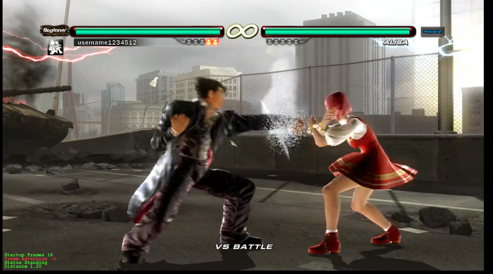

Tekken 6 frame data tool
========================

Tekken 6 frame data overlay for RPCS3.

[](https://www.youtube.com/watch?v=PMzXz8wr8RE)

Requirements
------------

- RPCS3
- Linux or Windows
- Tekken 6 Europe (BLES00635) with 01.03 update patch

Compiling
---------

Dependencies:

- C and C++ compiler (Tested with GCC)
- CMake
- Make
- Ninja

Make targets:

```bash
# Get 3rdparty sources for the GUI
make 3rdparty

# Release build
make release

# Debug build
make debug

# Run tests
make run_test

# Clean
make clean
```

Missing features
----------------

- Active frames

- Edge case logic

Known bugs
----------

- There exists a number of strings and multi-hit attacks that don't work correctly
